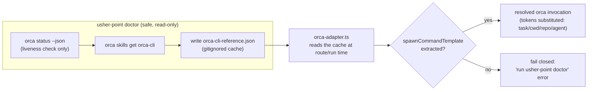

# Architecture

`usher-point` is split into three modules with one responsibility each
(screaming architecture — the folder name says what it does):

- **`src/routing/`** decides *where* a task should run.
- **`src/skills/`** decides *what* skills/tools are relevant to mention to
  whichever agent runs the task.
- **`src/adapters/` + `src/exec/`** are the boundary to external processes —
  each adapter *describes* a command, and `exec/run-command.ts` is the only
  place that actually spawns one.

`usher-point` never does the agent's work itself: it classifies, decides,
and dispatches (or, with `route`, just prints what it would dispatch).

## End-to-end flow

An explicit `--target` flag always wins outright, before either engine below
runs. Otherwise `--engine` picks the decision source: `heuristic` always uses
`classify.ts`/`decide.ts`; `jev` always calls the optional Jev model and
fails loudly if it's unavailable; `auto` (default) tries Jev first and falls
back to the heuristic on any failure.

```mermaid
flowchart TD
    A["user task string\n(usher-point route/run \"...\" [flags, --engine])"] --> B["classify.ts\nbuilds TaskShape\n(isMultiFile, isMultiRepo,\nneedsIsolation, explicitTarget, repoName)"]
    B --> Z{"explicitTarget set?"}
    Z -->|yes| C
    Z -->|no, engine=jev or auto| J["jev-model.ts\nHTTP POST to OpenRouter\n(typesafe/jev-*, via OPENROUTER_API_KEY)"]
    Z -->|no, engine=heuristic| C
    J -->|decision parsed OK| C
    J -->|disabled / no key / network error /\nbad status / unparseable reply → null| C["decide.ts\nwalks usher-point.config.json rules,\nfirst match wins\n(explicit --target always wins outright)"]
    C -->|target: claude-inline| D["claude-adapter.ts"]
    C -->|target: codex-cli| E["codex-adapter.ts"]
    C -->|target: orca-worktree| F["orca-adapter.ts"]
    D --> G["exec/run-command.ts\n(the only spawn point)"]
    E --> G
    F --> G
    G --> H1["claude -p \"...\" ..."]
    G --> H2["codex exec --sandbox ... \"...\""]
    G --> H3["orca <resolved subcommand> ..."]
```

Note: when Jev succeeds, its `Decision` is used directly and `decide.ts`'s
rule-walk is skipped for that invocation (the diagram merges both paths into
the same downstream box for space; see `src/cli.ts#resolveRoute` for the
exact branching). `cli.ts` prints which engine actually decided as `via:` in
`route`/`run` output either way.

`skills/select.ts` runs alongside this (not shown above for clarity): it
independently ranks candidate `SKILL.md` paths against the task text, from
`<cwd>/.atl/skill-registry.md` when present or a fallback scan of
`~/.agents/skills/*/SKILL.md` otherwise, and its output (a list of skill
names/paths) is passed into `claude-adapter.ts` to populate `--allowedTools`.
It never injects skill file contents.

## The Orca-worktree path (most fragile boundary)

Unlike `claude` and `codex`, Orca's own CLI subcommand syntax is not stable
across Orca releases, so `usher-point` deliberately never hardcodes it.
Instead, `usher-point doctor` refreshes a cached reference that
`orca-adapter.ts` treats as data at routing time:



`orca-adapter.ts`'s extraction is a conservative heuristic: it scans the
cached reference text for a line that looks like a literal
`orca <subcommand> ...` worktree-spawn invocation. If it can't find one, it
leaves `spawnCommandTemplate` undefined rather than guessing, and any
attempt to route to `orca-worktree` fails closed with a
"run `usher-point doctor`" message.

**Observed discrepancy vs. the original design plan
(`inherited-cooking-owl.md`):** in the version of the `orca-cli` skill
reference installed on this machine, the documented commands use an
uppercase `ORCA` placeholder (e.g. `ORCA worktree create ...`), not a
literal lowercase `orca` command line. `orca-adapter.ts`'s heuristic only
matches lines starting with lowercase `orca `, so on this machine
`usher-point doctor` refreshes the cache successfully but extracts no
`spawnCommandTemplate`, and `orca-worktree` routing currently always fails
closed — this was confirmed by running `doctor` and re-running the
`orca-worktree` verification case (see `docs/USAGE.md`). This is exactly
the fail-closed behavior the design intends (no hardcoded guess), but it
means the orca-worktree target is not currently reachable end-to-end on
this machine without a change to the extraction heuristic or the upstream
skill doc.

## Other discrepancies vs. the original design plan

- The plan (`inherited-cooking-owl.md`) describes three responsibilities as
  `route` / `select` / `handoff`. The actual code names the third module
  `adapters` + `exec` rather than `handoff` — same responsibility (delegate
  to `orca`/`codex`/`claude`, never reimplement their logic), different
  folder name.
- The plan's `skills/select.ts` section describes a fourth step: reading the
  chosen agent's MCP server config (`~/.codex/config.toml`
  `[mcp_servers.*]`, or Claude Code's loaded MCP list) and matching server
  names against the task. The actual `src/skills/select.ts` does not do
  this — it only ranks `SKILL.md` entries from the registry or fallback
  scan. There is no MCP-matching code anywhere in `src/skills/`.
