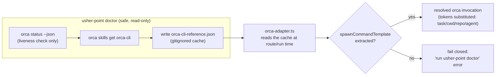

# Architecture

`usher-point` is split into three modules with one responsibility each
(screaming architecture — the folder name says what it does):

- **`src/routing/`** decides *where* a task should run.
- **`src/skills/`** decides *what* skills/tools are relevant to mention to
  whichever agent runs the task.
- **`src/adapters/` + `src/exec/`** are the boundary to external processes —
  each adapter *describes* a command, and `exec/run-command.ts` is the only
  place that actually spawns one.

`usher-point` never does the agent's work itself: it classifies, decides,
and dispatches (or, with `route`, just prints what it would dispatch).

## End-to-end flow

An explicit `--target` flag always wins outright, before either engine below
runs. Otherwise `--engine` picks the decision source: `heuristic` always uses
`classify.ts`/`decide.ts`; `jev` always calls the optional Jev model and
fails loudly if it's unavailable; `auto` (default) tries Jev first and falls
back to the heuristic on any failure.

```mermaid
flowchart TD
    A["user task string\n(usher-point route/run \"...\" [flags, --engine])"] --> B["classify.ts\nbuilds TaskShape\n(isMultiFile, isMultiRepo,\nneedsIsolation, explicitTarget, repoName)"]
    B --> Z{"explicitTarget set?"}
    Z -->|yes| K["skills/select.ts\nkeyword-overlap ranking"]
    K --> C
    Z -->|no, engine=heuristic| K
    Z -->|no, engine=jev or auto| CAND["skills/select.ts\ngatherSkillCandidates() + capCandidates()\n(raw candidates, NO ranking)"]
    CAND --> J["jev-model.ts\nONE HTTP POST to OpenRouter\n(typesafe/jev-*, via OPENROUTER_API_KEY)\ncandidate skills passed in as context"]
    J -->|"unified reply parsed OK:\n{ target, confidence, reasoning,\n  skills[], modelOverride? }"| C
    J -->|disabled / no key / network error /\nbad status / unparseable reply → null| K
    C["decide.ts\nwalks usher-point.config.json rules,\nfirst match wins\n(explicit --target always wins outright)"]
    C -->|target: claude-inline| D["claude-adapter.ts"]
    C -->|target: codex-cli| E["codex-adapter.ts"]
    C -->|target: orca-worktree| F["orca-adapter.ts"]
    D --> G["exec/run-command.ts\n(the only spawn point)"]
    E --> G
    F --> G
    G --> H1["claude -p \"...\" ..."]
    G --> H2["codex exec --sandbox ... \"...\""]
    G --> H3["orca <resolved subcommand> ..."]
```

Note: when Jev succeeds, its `Decision` (target + skills + optional
modelOverride, all from the one call) is used directly, `decide.ts`'s
rule-walk is skipped for that invocation, and `skills/select.ts`'s
keyword-overlap ranking (the `K` box above) is skipped too — Jev's `skills[]`
is used as-is instead (see `src/cli.ts#resolveRoute` for the exact
branching). On any Jev failure, both routing AND skill selection fall back to
the heuristic together (`K` + `C`) — never a mixed state. `cli.ts` prints
which engine actually decided as `via:` in `route`/`run` output either way,
plus a `model override:` line whenever `decision.modelOverride` is set.

**Unified Jev decision (current design, since this change):** when the Jev
engine is active, `jev-model.ts`'s `decideViaJevModel()` no longer only picks
a `target` — it makes one OpenRouter call that returns target, confidence,
reasoning, a `skills` subset of the candidate list it was shown, and an
optional `modelOverride` (`{ model?, effort? }`) for the resolved target's
configured default. The candidate skill list itself is still gathered by
`skills/select.ts`'s `gatherSkillCandidates()` (reading the same
`.atl/skill-registry.md` or `~/.agents/skills/*/SKILL.md` sources as the
heuristic path) and capped by `capCandidates()` before being embedded in the
prompt — `jev-model.ts` never imports from `skills/` itself, it only receives
already-gathered `{name, path, description}` data as a parameter, keeping the
routing/skills module boundary intact. `decisionSkillsToMatches()` then maps
Jev's returned skill names/paths back to the same candidate list for display.
This unification applies **only** to the Jev-engine path: the heuristic
engine (`classify.ts` + `decide.ts` + `skills/select.ts`'s keyword-overlap
scoring) is completely unchanged and remains the fallback whenever Jev is
disabled, unavailable, or fails for any reason.

`decision.modelOverride`, when set, is applied generically in
`cli.ts#buildCommandSpec` on top of whichever target's `TargetConfig` was
resolved (overriding `defaultModel`/`defaultEffort`) before handing it to
that target's adapter — it is not hardcoded to `codexCli`, even though
`codex-adapter.ts` is currently the only adapter that reads those two fields
back out.

## The Orca-worktree path (most fragile boundary)

Unlike `claude` and `codex`, Orca's own CLI subcommand syntax is not stable
across Orca releases, so `usher-point` deliberately never hardcodes it.
Instead, `usher-point doctor` refreshes a cached reference that
`orca-adapter.ts` treats as data at routing time:



`orca-adapter.ts`'s extraction is a conservative heuristic: it scans the
cached reference text for a line that looks like an `orca <subcommand> ...`
worktree-spawn invocation. If it can't find one, it leaves
`spawnCommandTemplate` undefined rather than guessing, and any attempt to
route to `orca-worktree` fails closed with a "run `usher-point doctor`"
message.

**Resolved discrepancy vs. the original design plan
(`inherited-cooking-owl.md`):** the version of the `orca-cli` skill
reference installed on this machine documents its example commands with an
uppercase `ORCA` placeholder (e.g. `ORCA worktree create ...`), not a
literal lowercase `orca` command line — the skill's own "Start Here" section
explains this explicitly: "`ORCA` is a documentation placeholder. Replace it
with the chosen executable before running the command." The original
heuristic only matched lines starting with a literal lowercase `orca `, so
on this machine `usher-point doctor` refreshed the cache successfully but
extracted no `spawnCommandTemplate`, and `orca-worktree` routing always
failed closed — confirmed by running `doctor` and re-running the
`orca-worktree` verification case.

This has since been fixed: `extractSpawnCommandTemplate()` now (1) matches
the leading `orca`/`ORCA` token case-insensitively — safe because
`buildOrcaCommand` already discards that first token and substitutes the
real resolved binary, so this is still pure parsing of Orca's own
documented syntax, never a hardcoded guess; (2) requires an actual
`worktree create` (or `spawn`) subcommand rather than matching any line
that merely contains the word "worktree", since the same reference text
also documents worktree *management* commands (`worktree ps`, `worktree
list`, `worktree rm`, ...) that would otherwise be matched first; and (3)
tokenizes quoted example values (`--prompt "<task brief>"`) as a single
token instead of splitting on the space inside the quotes. Re-running the
`orca-worktree` verification case after this fix now resolves a real
command (see `docs/USAGE.md`) instead of failing closed.

One caveat remains, and is *not* a bug: the cached reference's own example
values are illustrative placeholders (`<task-name>`, `"<task brief>"`), not
`usher-point`'s `{{task}}`/`{{cwd}}`/`{{repo}}`/`{{agent}}` token syntax, so
`buildOrcaCommand`'s substitution step has nothing to replace in this
particular line and the resolved command still carries the doc's own
example text rather than the live task's values. Mapping `<...>`-style doc
placeholders to specific flags would itself be exactly the kind of
hardcoded assumption about Orca's syntax this module is designed to avoid,
so it was deliberately left alone — this is a known, honestly-documented
limitation, not a silently-forced success.

## Other discrepancies vs. the original design plan

- The plan (`inherited-cooking-owl.md`) describes three responsibilities as
  `route` / `select` / `handoff`. The actual code names the third module
  `adapters` + `exec` rather than `handoff` — same responsibility (delegate
  to `orca`/`codex`/`claude`, never reimplement their logic), different
  folder name.
- The plan's `skills/select.ts` section describes a fourth step: reading the
  chosen agent's MCP server config (`~/.codex/config.toml`
  `[mcp_servers.*]`, or Claude Code's loaded MCP list) and matching server
  names against the task. The actual `src/skills/select.ts` does not do
  this — it only ranks `SKILL.md` entries from the registry or fallback
  scan. There is no MCP-matching code anywhere in `src/skills/`.
